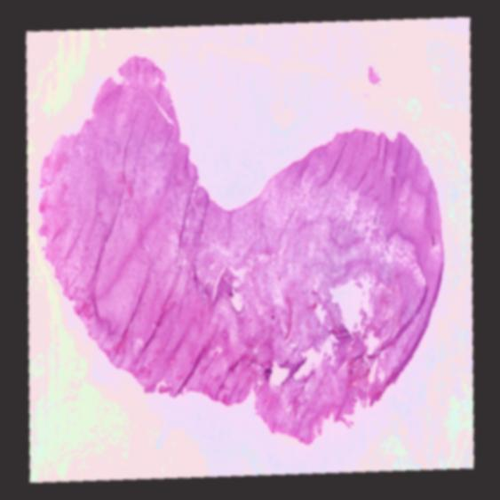
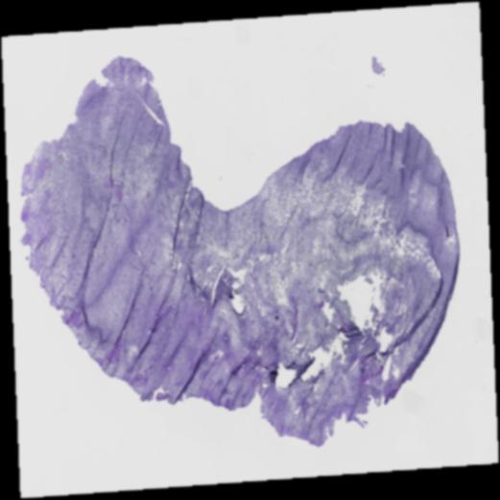
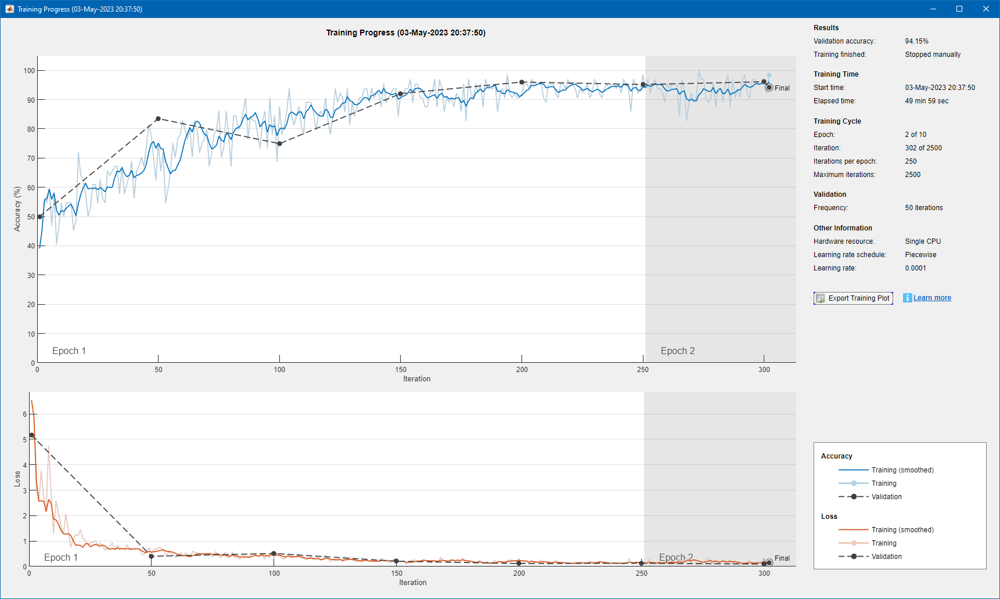
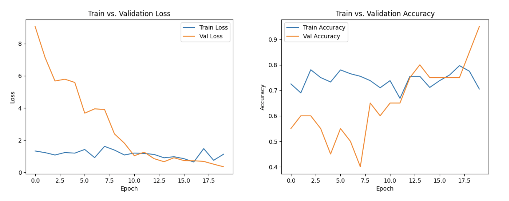
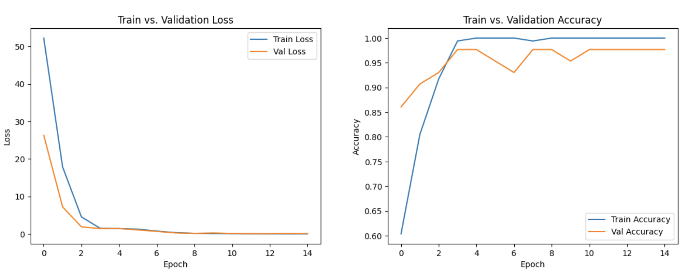

# TCGA-CNN
A convolutional neural network implementation for predicting gene expression from H&amp;E-stained histology slides.

## Creating a manifest

The manifest is created in the [GDC Data Portal repository](https://portal.gdc.cancer.gov/repository) by adding the
desired files to the cart and downloading. From there, the manifest is entered into the dataProcessing.py file for
processing to occur. Whole slide images are selected and added to the cart and downloaded.

## Downloading manifest data

Once a manifest has been created, the corresponding manifest data must be downloaded. This can be done using the
[GDC Data Transfer Tool](https://gdc.cancer.gov/access-data/gdc-data-transfer-tool). Downloading the binary
distribution for your system.

The GDC Data Transfer Tool executable should then be placed in the same directory as the manifest that is to be read.
From the command line, the following will allow the GDC Data Transfer Tool to download the data for the maifest:
```commandline
gdc-client download -m manifest.txt
```

## Data labeling method

Data presented by TCGA project doesn't include labels conducive to training a neural network in their manifest data.
To circumvent this problem, a python script to scrape web data is implemented. This script scrapes the TCGA whole slide
image database for the appropriate label—either as primary tumor or as solid tissue normal. The input for this script
is the manifest file produced by the GDC Data Portal.

To label data, the dataPreprocessing.py script can be run using the following command:
```commandline
python dataPreprocessing.py /pathToMainfest/manifest.txt
```


_Manifest before labeling._

_Manifest after labeling._

## Data processing method for training, testing, and validation

Training and testing has been done on whole slide images from the 5 most prevalent cancer types. Due to imbalances that
exist in TCGA project, we sought to create as balanced of a dataset as possible, although it was not always possible.
Before data augmentation, whole slide images were collected from manifest files as follows:
Cancer Manifest Files:

| Cancer type       | manifest                | Tumor | Normal |
|-------------------|-------------------------|-------|--------|
| Brain             | brainManifestFinal.txt  | 94    | 6      |
| Breast            | breastManifestFinal.txt | 135   | 60     |
| Kidney            | kidneyManifestFinal.txt | 92    | 53     |
| Ovarian           | ovaryManifestFinal.txt  | 48    | 51     |
| Bronchus and Lung | lungManifestFinal.txt   | 92    | 52     |

After using the GDC Client Tool to download the .SVS whole slide images we arrived at a common cancer dataset that
included 208 solid tissue normal samples and 315 primary tumor samples. To expand the size of the dataset, a Matlab
script to create a balanced, augmented dataset was created. This was used to create an augmented dataset of 20,000
images.


_Original image sample._


_Example of augmentation of the original image._


_Example of augmentation of the original image._

## Whole slide image training results

The Matlab implementation was trained using the 20,000 image balanced augmented dataset, while the Python
implementation has only been trained using ImageDataGenerator from Keras library to rotate, shift width, shift height,
shear and zoom images during model training. The resulting data was not robust enough to achieve the desired accuracy.
In future tests, we plan to use the 20,000 image augmented dataset to train the Python model.



_Matlab training achieved a validation accuracy of 94.15%._



_Matlab training achieved a validation accuracy of 82.45%._


## RNA-Seq training results
A simple feed forward network was implemented to analyze RNA-Seq data. The feedforward network performed with an
accuracy of 0.97 and loss of 0.14. Although it performed better than the python whole-slide image model, it still faces
issues of a small dataset. Increasing the size of the dataset would prevent overfitting issues in the FFN. 



_Matlab training achieved a validation accuracy of 97.96%._


## Citations
> Oyelade, O. N., & Ezugwu, A. E. (2021). A bioinspired neural architecture search based convolutional neural network for breast cancer detection using histopathology images. Scientific Reports, 11(1), 1-28. https://doi.org/10.1038/s41598-021-98978-7
> 
