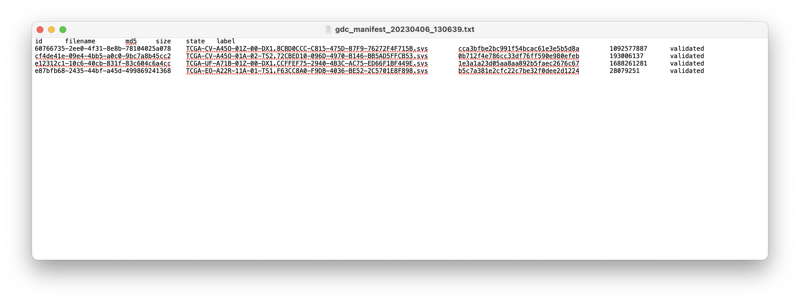
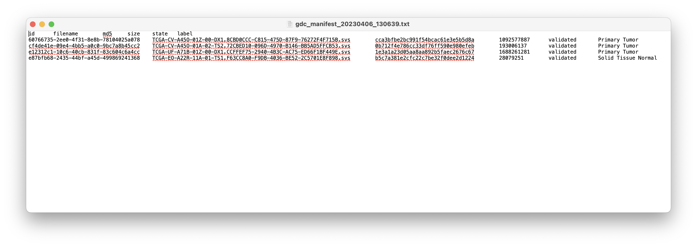

# TCGA-CNN
A convolutional neural network implementation for predicting gene expression from H&amp;E-stained histology slides.

## Creating a manifest

The manifest is created in the [GDC Data Portal repository](https://portal.gdc.cancer.gov/repository) by adding the
desired files to the cart and downloading. From there, the manifest is entered into the dataProcessing.py file for
processing to occur. Whole slide images are selected and added to the cart and downloaded.

## Downloading manifest data

Once a manifest has been created, the corresponding manifest data must be downloaded. This can be done using the
[GDC Data Transfer Tool](https://gdc.cancer.gov/access-data/gdc-data-transfer-tool). Downloading the binary
distribution for your system.

The GDC Data Transfer Tool executable should then be placed in the same directory as the manifest that is to be read.
From the command line, the following will allow the GDC Data Transfer Tool to download the data for the maifest:
```commandline
gdc-client download -m manifest.txt
```

## Data labeling method

Data presented by TCGA project doesn't include labels conducive to training a neural network in their manifest data.
To circumvent this problem, a python script to scrape web data is implemented. This script scrapes the TCGA whole slide
image database for the appropriate label—either as primary tumor or as solid tissue normal. The input for this script
is the manifest file produced by the GDC Data Portal.

To label data, the dataPreprocessing.py script can be run using the following command:
```commandline
python dataPreprocessing.py /pathToMainfest/manifest.txt
```


_Manifest before labeling._

_Manifest after labeling._

## Data processing method for training, testing, and validation

Training, testing, and validation has been done on whole slide images from 5 different cancer types, each with 100
whole slide images for each cell type. For each of these, 60 of the whole slide images are primary tumors whereas 40 are
normal solid tissue.

Cancer Manifest Files:

| Cancer type       | manifest                     | Tumor | Normal |
|-------------------|------------------------------|-------|--------|
| Brain             | gdc_manifest_20230409_205108 | 94    | 6      |
| Breast            | gdc_manifest_20230408_202627 | 92    | 8      |
| Kidney            | gdc_manifest_20230408_203008 | 92    | 8      |
| Ovarian           | gdc_manifest_20230408_210113 | 97    | 3      |
| Bronchus and Lung | gdc_manifest_20230408_210429 | 92    | 8      |